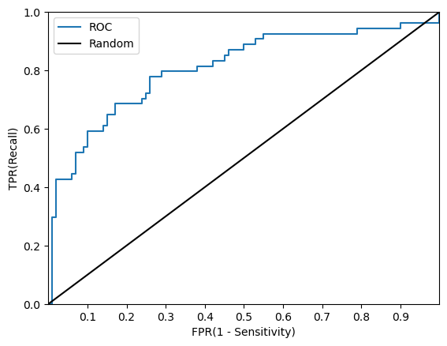
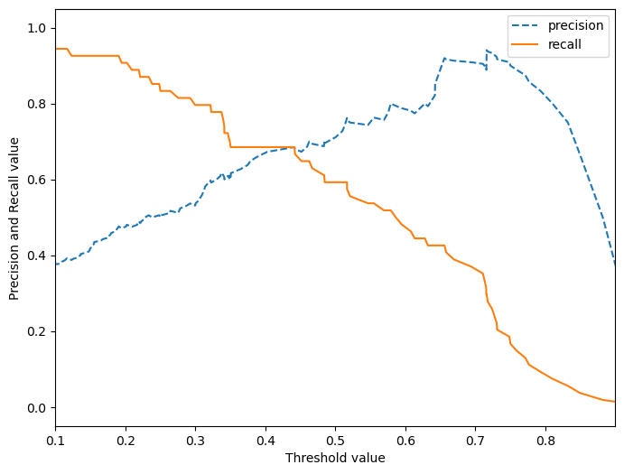

파일 'Pima Indian Diabetes.ipynb'을 기반으로 `clf_evaluation` 모듈의 사용법에 대한 `README.md` 파일을 작성하겠습니다. 이 문서는 모듈의 기능, 사용법, 예제 사용 사례를 포함할 것입니다. `clf_evaluation` 모듈이 분류 모델의 성능 평가에 사용되는 것을 가정하여 작성하겠습니다.

---

# clf_evaluation 모듈 사용법

## 소개
`clf_evaluation` 모듈은 분류 모델의 성능을 평가하기 위해 다양한 지표를 계산하고 시각화하는 데 사용됩니다. 이 모듈은 정확도, 정밀도, 재현율, F1 점수, 혼동 행렬, ROC AUC와 같은 핵심적인 분류 성능 지표를 포함하고 있습니다.

## 기능
- 정확도, 정밀도, 재현율, F1 점수 및 ROC AUC 점수 계산
- 혼동 행렬 생성
- ROC 곡선 및 정밀도-재현율 곡선 시각화
- 다양한 임계값에 대한 모델 성능 평가

## 설치 방법
이 모듈은 프로젝트의 `lib` 또는 `utils` 폴더에 위치해야 합니다. 모듈을 사용하기 위해서는 해당 폴더를 Python 경로에 추가해야 할 수도 있습니다.

```python
import sys
sys.path.append('path_to_lib')
```

## 사용 예제
다음은 Pima Indian Diabetes 데이터셋을 사용한 분류 모델의 성능 평가 예제입니다.

```python
# 필요한 라이브러리와 모듈을 임포트합니다.
import pandas as pd
from sklearn.model_selection import train_test_split
from sklearn.linear_model import LogisticRegression
from clf_evaluation import print_eval, roc_curve_plot, precision_recall_curve_plot

# 데이터를 로드하고 준비합니다.
data = pd.read_csv('dataset.csv')
X = data.drop('target', axis=1)
y = data['target']

# 데이터를 훈련 세트와 테스트 세트로 분할합니다.
X_train, X_test, y_train, y_test = train_test_split(X, y, test_size=0.2, random_state=42)

# 분류 모델을 훈련시킵니다.
clf = LogisticRegression()
clf.fit(X_train, y_train)

# 예측을 수행합니다.
pred = clf.predict(X_test)
pred_proba = clf.predict_proba(X_test)[:, 1]

# 성능 지표를 출력합니다.
print_eval(y_test, pred, pred_proba)
```
```
Output:

Confusion Matrix
[[87 13]
 [22 32]]
Accuracy: 0.7727 Precision: 0.7111 Recall: 0.5926
F1: 0.6465 ROC AUC: 0.8083
```

```python
# ROC 곡선과 정밀도-재현율 곡선을 그립니다.
roc_curve_plot(y_test, pred_proba)
```


```python
precision_recall_curve_plot(y_test, pred_proba)
```


```python
# 다양한 임계값에서의 성능 평가를 수행합니다.
thresholds = [0.3, 0.4, 0.5, 0.6, 0.7]
eval_df = get_eval_by_threshold(y_test, pred_proba.reshape(-1, 1), thresholds)
print(eval_df)
```
<div>
<style scoped>
    .dataframe tbody tr th:only-of-type {
        vertical-align: middle;
    }

    .dataframe tbody tr th {
        vertical-align: top;
    }

    .dataframe thead th {
        text-align: right;
    }
</style>
<table border="1" class="dataframe">
  <thead>
    <tr style="text-align: right;">
      <th></th>
      <th>Accuracy</th>
      <th>Precision</th>
      <th>Recall</th>
      <th>F1</th>
      <th>ROC AUC</th>
    </tr>
  </thead>
  <tbody>
    <tr>
      <th>0.30</th>
      <td>0.701299</td>
      <td>0.551282</td>
      <td>0.796296</td>
      <td>0.651515</td>
      <td>0.843333</td>
    </tr>
    <tr>
      <th>0.33</th>
      <td>0.740260</td>
      <td>0.597222</td>
      <td>0.796296</td>
      <td>0.682540</td>
      <td>0.843333</td>
    </tr>
    <tr>
      <th>0.36</th>
      <td>0.746753</td>
      <td>0.619048</td>
      <td>0.722222</td>
      <td>0.666667</td>
      <td>0.843333</td>
    </tr>
    <tr>
      <th>0.39</th>
      <td>0.753247</td>
      <td>0.633333</td>
      <td>0.703704</td>
      <td>0.666667</td>
      <td>0.843333</td>
    </tr>
    <tr>
      <th>0.42</th>
      <td>0.779221</td>
      <td>0.692308</td>
      <td>0.666667</td>
      <td>0.679245</td>
      <td>0.843333</td>
    </tr>
    <tr>
      <th>0.45</th>
      <td>0.785714</td>
      <td>0.705882</td>
      <td>0.666667</td>
      <td>0.685714</td>
      <td>0.843333</td>
    </tr>
    <tr>
      <th>0.48</th>
      <td>0.798701</td>
      <td>0.744681</td>
      <td>0.648148</td>
      <td>0.693069</td>
      <td>0.843333</td>
    </tr>
    <tr>
      <th>0.50</th>
      <td>0.798701</td>
      <td>0.767442</td>
      <td>0.611111</td>
      <td>0.680412</td>
      <td>0.843333</td>
    </tr>
  </tbody>
</table>
</div>